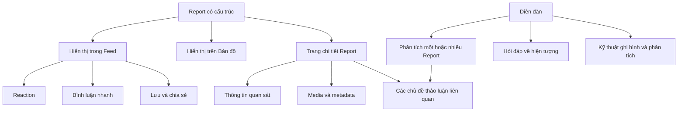

À đúng, tui đã hiểu sai câu **“bỏ phần bài viết”** vì trong tài liệu hiện tại `bài viết = Report`. Ý của bạn thực tế là:

- **Report luôn tồn tại** và là dữ liệu quan sát có cấu trúc;
- Report được hiển thị trên một trang feed cuộn vô hạn;
- Feed có tương tác nhanh như reaction và comment;
- Có thể xây thêm một khu vực diễn đàn để thảo luận sâu;
- Bạn đang cân nhắc bỏ lớp tương tác nhanh trên feed để tập trung vào diễn đàn.

Với mô hình này, tui đề xuất **giữ cả feed và diễn đàn**, nhưng phải phân vai rõ ràng.

# Mô hình hợp lý



## Ba lớp này có nhiệm vụ khác nhau

| Thành phần         | Mục đích                                                       |
| ------------------ | -------------------------------------------------------------- |
| `Report`           | Lưu dữ liệu quan sát có cấu trúc                               |
| `Feed`             | Giúp người dùng khám phá Report và tương tác nhanh             |
| `Discussion Topic` | Phân tích sâu, đính kèm tài liệu và theo dõi một vấn đề cụ thể |

Như vậy, feed không tạo ra một loại “bài viết” mới. Nó chỉ là cách trình bày danh sách Report.

---

# 1. Có nên giữ feed infinite scroll không?

**Nên giữ.**

Feed giúp sản phẩm có tính xã hội:

- Khám phá báo cáo mới;
- Xem báo cáo ở khu vực đang theo dõi;
- Xem nội dung có ảnh/video;
- Theo dõi hoạt động của thành viên;
- Tương tác nhanh;
- Điều hướng sang bản đồ hoặc thảo luận chuyên sâu.

Một thẻ Report trên feed có thể hiển thị:

```text
Nguyễn Văn A báo cáo một hiện tượng “Đốm sáng”
Đà Nẵng · 21:05 · 20/09/2026

[Ảnh hoặc video]
[Mô tả ngắn]

12 người quan tâm · 8 bình luận · 2 thảo luận
[Quan tâm] [Bình luận] [Thảo luận] [Lưu]
```

Feed là lối vào nội dung. Người dùng không cần mở bản đồ hoặc diễn đàn mỗi lần muốn xem hoạt động mới.

---

# 2. Có nên giữ comment vui vẻ dưới Report không?

**Có thể giữ. Comment không bắt buộc phải tạo ra kết luận.**

Comment phục vụ:

- Phản ứng tự nhiên;
- Hỏi nhanh người báo cáo;
- Nhắc tới người dùng khác;
- Chia sẻ trải nghiệm tương tự;
- Tạo cảm giác cộng đồng;
- Giữ người dùng tương tác với sản phẩm.

Ví dụ:

- “Tui cũng thấy cái này tối qua.”
- “Bạn quay hướng biển hay hướng thành phố vậy?”
- “Nhìn khá giống Starlink.”
- “Video này quay bằng máy gì vậy?”

Đó là tương tác xã hội hợp lệ. Không nên đánh giá mọi comment là dữ liệu rác.

Để comment không cạnh tranh với diễn đàn, comment nên đơn giản:

- Nội dung ngắn;
- Trả lời một cấp;
- Mention;
- Reaction;
- Báo cáo vi phạm.

Phân tích dài, nhiều tài liệu và nhiều nhánh được chuyển sang diễn đàn.

---

# 3. Diễn đàn dùng để làm gì?

Diễn đàn dành cho nội dung cần một chủ đề riêng, có tiêu đề và mục tiêu rõ ràng.

Ví dụ:

### Chủ đề gắn với một Report

> “Phân tích hiện tượng nhấp nháy trong video Report #125”

### Chủ đề gắn với nhiều Report

> “Ba báo cáo đốm sáng tại Đà Nẵng tối 20/09 có liên quan không?”

### Chủ đề kiến thức chung

> “Làm thế nào phân biệt Starlink với máy bay?”

### Chủ đề kỹ thuật

> “Ảnh hưởng của chống rung điện tử khi quay vật thể ban đêm”

Một topic có thể gồm:

```text
DiscussionTopic
├── title
├── content
├── topic_type
├── created_by
├── linked_reports[]
├── attachments[]
├── references[]
├── replies[]
└── summary
```

Điểm hay là một topic có thể liên kết nhiều Report mà chưa cần tạo `Event`. Việc liên kết chỉ mang ý nghĩa:

> Những Report này đang được đem ra so sánh trong cùng một cuộc thảo luận.

Nó chưa khẳng định chúng mô tả cùng một hiện tượng.

---

# 4. Làm sao tránh feed và forum bị hỗn tạp?

Cần đặt quy tắc rõ:

## Bình luận trên feed

Dùng khi người dùng muốn:

- Phản ứng nhanh;
- Hỏi tác giả một câu ngắn;
- Góp ý đơn giản;
- Trao đổi mang tính xã hội.

## Chủ đề diễn đàn

Dùng khi người dùng muốn:

- Phân tích ảnh/video;
- Đính kèm tệp;
- Trích dẫn nguồn bên ngoài;
- Đối chiếu chuyến bay, vệ tinh hoặc thời tiết;
- So sánh nhiều Report;
- Đề xuất giả thuyết;
- Theo dõi một vấn đề qua nhiều lượt trao đổi.

Mỗi Report nên có nút:

> **Tạo chủ đề thảo luận**

Khi nhấn, hệ thống tự liên kết Report hiện tại vào topic. Trang Report cũng hiển thị:

> **Các thảo luận liên quan — 2**

Như vậy, người dùng không cần đăng lại nội dung Report vào forum.

---

# 5. Like/dislike Report nên xử lý thế nào?

Tui không đề xuất dùng cặp `Like/Dislike` cho Report vì `Dislike` rất mơ hồ:

- Không thích nội dung?
- Không tin người báo cáo?
- Cho rằng video giả?
- Không đồng ý với cách mô tả?
- Không thích chủ đề UFO?

Nó cũng có thể khiến người dùng ngại báo cáo những gì họ quan sát được.

Nên sử dụng các hành động có ý nghĩa cụ thể hơn:

- **Quan tâm**;
- **Lưu**;
- **Theo dõi cập nhật**;
- **Chia sẻ**;
- **Tôi cũng quan sát thấy**;
- **Báo cáo vi phạm**.

Trong đó, **“Tôi cũng quan sát thấy”** không nên chỉ tăng một con số. Nó mở biểu mẫu để người dùng cung cấp một Report mới hoặc thông tin quan sát bổ sung.

Nếu vẫn muốn giữ chất mạng xã hội, có thể dùng reaction:

- Thú vị;
- Cần thêm dữ liệu;
- Đã từng thấy tương tự.

Các reaction này không được dùng để tính “độ thật” của Report.

---

# 6. Vote trong diễn đàn

Vote trong diễn đàn có thể dùng cho mục đích:

> “Phản hồi này có hữu ích cho cuộc thảo luận không?”

Nó không nên mang nghĩa:

> “Giả thuyết này đúng hay sai?”

Có thể đặt nút là **Hữu ích** thay cho upvote/downvote.

Muốn phản bác một giả thuyết, người dùng nên:

- Viết phản hồi;
- Đính kèm dữ liệu;
- Trích dẫn nguồn;
- Chỉ ra điểm không phù hợp.

Điều đó có giá trị hơn một lượt downvote không có lý do.

---

# 7. Cấu trúc điều hướng đề xuất

Ứng dụng mobile có thể có năm mục chính:

```text
Trang chủ | Bản đồ | Tạo báo cáo | Thảo luận | Hồ sơ
```

## Trang chủ

- Feed Report;
- Báo cáo từ khu vực hoặc người dùng đang theo dõi;
- Chủ đề thảo luận nổi bật có thể xuất hiện dưới dạng gợi ý.

## Bản đồ

- Khám phá Report theo vị trí và thời gian;
- Lọc theo loại quan sát;
- Gom marker khi thu nhỏ bản đồ.

## Tạo báo cáo

- Camera;
- Cảm biến;
- Thông tin quan sát;
- Media và metadata.

## Thảo luận

- Chủ đề mới;
- Phân tích Report;
- Hỏi đáp kiến thức;
- Kỹ thuật ghi nhận và phân tích;
- Chủ đề đang theo dõi.

## Hồ sơ

- Report đã gửi;
- Topic đã tạo;
- Nội dung đã lưu;
- Hoạt động đóng góp.

# Phương án nên chốt

Tui đề xuất sản phẩm hoàn chỉnh gồm:

1. **Report có cấu trúc** là nội dung trung tâm;
2. **Feed infinite scroll** hiển thị Report;
3. **Reaction và comment ngắn** phục vụ tương tác xã hội;
4. **Diễn đàn riêng** dành cho phân tích sâu;
5. Một topic có thể liên kết với một hoặc nhiều Report;
6. Report hiển thị danh sách topic đang thảo luận về nó;
7. Không dùng like/dislike để suy ra độ tin cậy;
8. Không tạo thêm một loại “bài viết mạng xã hội” nằm ngoài Report.

Như vậy sản phẩm vẫn có trải nghiệm xã hội giống Facebook ở tầng khám phá và tương tác, đồng thời có chiều sâu thảo luận giống Reddit hoặc Stack Overflow. Hai phần không hỗn tạp vì chúng phục vụ hai mức tương tác khác nhau.
