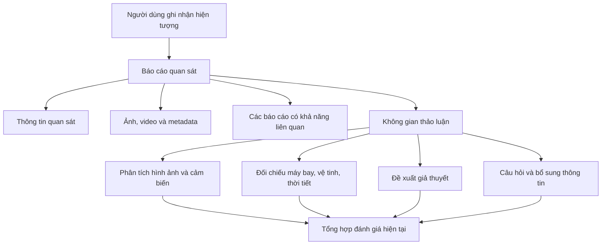

Tui hiểu vấn đề rồi. Sau khi đọc [Gợi ý diễn đàn thảo luận](/home/hades/code/project/dacn/docs/Goi-y-dien-dan-thao-luan-gemini.md), tui nghĩ **không nên xây cả mạng xã hội đăng bài và một diễn đàn độc lập**. Hai luồng nội dung sẽ cạnh tranh nhau và người dùng không biết nên đăng ở đâu.

Giải pháp gọn nhất là:

> **Giữ Báo cáo quan sát làm nội dung trung tâm. Bỏ bài viết tự do. Thay phần bình luận đơn giản bằng không gian thảo luận có cấu trúc nằm bên trong từng báo cáo.**

# 1. Những thứ nên giữ hoặc bỏ

| Thành phần                                             | Quyết định đề xuất                              |
| ------------------------------------------------------ | ----------------------------------------------- |
| Bài đăng trạng thái tự do như Facebook                 | **Bỏ**                                          |
| Báo cáo quan sát có cấu trúc                           | **Giữ, đây là nội dung trung tâm**              |
| Bình luận phẳng bên dưới báo cáo                       | **Bỏ**                                          |
| Luồng thảo luận có tiêu đề, trả lời và tệp đính kèm    | **Giữ**                                         |
| Upvote/downvote báo cáo                                | **Bỏ**                                          |
| Upvote/downvote giả thuyết                             | **Chưa nên dùng**                               |
| Đánh dấu câu trả lời được chấp nhận như Stack Overflow | **Không phù hợp**                               |
| Theo dõi báo cáo, người dùng, chủ đề                   | **Giữ**                                         |
| Bảng tin hoạt động                                     | **Giữ nhưng chỉ hiển thị báo cáo và thảo luận** |
| Diễn đàn chung tách khỏi báo cáo                       | **Không nên làm ở giai đoạn đầu**               |

“Bài viết” trong tài liệu hiện tại đang đồng nghĩa với `Report`. Hai khái niệm này nên được tách lại:

- `Report`: báo cáo quan sát có cấu trúc;
- `DiscussionThread`: một chủ đề phân tích bên trong Report;
- `Reply`: phản hồi trong một chủ đề.

---

# 2. Cấu trúc sản phẩm phù hợp



Một báo cáo có thể có giao diện:

## Tổng quan

- Người quan sát thấy gì;
- Thời gian, vị trí và hướng nhìn;
- Đặc điểm hiện tượng;
- Trạng thái xem xét hiện tại.

## Tư liệu

- Ảnh, video, âm thanh;
- Nguồn gốc tệp;
- Metadata camera;
- Tệp phân tích do thành viên bổ sung.

## Thảo luận

Các thành viên tạo chủ đề riêng:

- “Đốm sáng có thể là Starlink không?”
- “Phân tích chuyển động camera trong video”
- “Đối chiếu với dữ liệu chuyến bay”
- “So sánh với báo cáo tại Hội An cùng thời điểm”

## Đánh giá hiện tại

- Chưa được xem xét;
- Đang thu thập thêm dữ liệu;
- Có cách giải thích tiềm năng;
- Có khả năng đã giải thích;
- Chưa thể giải thích do thiếu dữ liệu.

---

# 3. Tại sao không nên chuyển hoàn toàn thành diễn đàn?

Nếu bỏ `Report` và chỉ giữ forum, sản phẩm sẽ trở thành:

> Người dùng đăng một chủ đề, đính kèm hình ảnh và mọi người trả lời.

Khi đó sản phẩm lại gặp đúng vấn đề ban đầu:

- Thời gian quan sát nằm lẫn trong nội dung;
- Vị trí không có cấu trúc;
- Không truy vấn được theo bán kính;
- Không hiển thị chính xác trên bản đồ;
- Không lọc được theo hình dạng, màu sắc và chuyển động;
- Không tự động thu thập metadata thiết bị;
- Khó tìm các quan sát liên quan;
- Khó xuất thành tập dữ liệu.

Nó sẽ gần với Reddit theo chủ đề UFO và làm mất điểm khác biệt quan trọng nhất của đề tài.

Vì vậy:

> **Report cung cấp dữ liệu. Discussion giúp cộng đồng diễn giải dữ liệu.**

Hai phần này có vai trò khác nhau và cần tồn tại cùng nhau trên cùng một trang.

---

# 4. Có cần một diễn đàn chung không?

Hiện tại chưa cần.

Mỗi luồng thảo luận nên gắn với đúng một báo cáo:

```text
Report
└── DiscussionThread
    ├── title
    ├── discussion_type
    ├── created_by
    ├── attachments
    └── replies
```

Các loại thảo luận có thể gồm:

```text
GENERAL_QUESTION
MEDIA_ANALYSIS
SENSOR_ANALYSIS
ENVIRONMENT_CROSSCHECK
RELATED_OBSERVATION
HYPOTHESIS
REQUEST_MORE_INFORMATION
```

Người dùng vẫn có thể vào trang “Thảo luận” để xem tất cả chủ đề đang hoạt động. Tuy nhiên, đó chỉ là **một cách tổng hợp các thread thuộc các báo cáo**, không phải một forum có hệ thống bài viết riêng.

Nhờ vậy sẽ không xảy ra:

- Một bài đăng ở bảng tin;
- Một báo cáo trên bản đồ;
- Một chủ đề khác ở diễn đàn;
- Ba nơi cùng bàn về một hiện tượng.

---

# 5. Upvote/downvote có thể bỏ hoàn toàn không?

**Có, và tui nghiêng về việc bỏ trong phiên bản đầu.**

Trong chủ đề UAP:

- Nhiều upvote không chứng minh giả thuyết đúng;
- Downvote dễ trở thành biểu quyết theo niềm tin;
- Nội dung đăng trước thường có lợi thế;
- Danh tiếng của tác giả có thể ảnh hưởng người đọc;
- Một giả thuyết ít phổ biến vẫn có thể có bằng chứng tốt.

Nếu vẫn cần giúp người dùng lọc nội dung, có thể sử dụng các hành động rõ nghĩa hơn:

- **Hữu ích**;
- **Có nguồn tham khảo**;
- **Yêu cầu bổ sung nguồn**;
- **Báo cáo vi phạm**;
- **Theo dõi thảo luận**.

Nút “Hữu ích” dùng để sắp xếp nội dung tham khảo, không được dùng để tính xác suất giả thuyết đúng.

---

# 6. Mô hình Stack Overflow không thể áp dụng nguyên bản

Stack Overflow hoạt động tốt vì nhiều câu hỏi kỹ thuật thường có câu trả lời kiểm chứng được: đoạn code chạy hoặc không chạy.

Với một báo cáo UAP:

- Người đăng không chắc mình đã nhìn thấy gì;
- Người đăng không đủ cơ sở chọn “câu trả lời đúng”;
- Cộng đồng không có đầy đủ dữ liệu;
- Một giả thuyết nhận nhiều vote vẫn có thể sai.

Do đó, không nên để tác giả bấm **“Chấp nhận câu trả lời”**.

Có thể học Stack Overflow ở các điểm:

- Mỗi chủ đề có mục tiêu rõ;
- Câu trả lời có thể đính kèm bằng chứng;
- Nội dung có lịch sử chỉnh sửa;
- Có trích dẫn nguồn;
- Có kiểm duyệt;
- Có trạng thái xử lý.

Phần kết luận nên do một quy trình xem xét riêng quản lý.

---

# 7. Làm thế nào để thảo luận thực sự đi đến kết quả?

Chỉ đổi comment thành forum chưa giải quyết được vấn đề. Muốn có đầu ra, hệ thống cần một đối tượng **giả thuyết** hoặc **đánh giá**.

Ví dụ:

```text
Hypothesis
├── title: "Có khả năng là chuỗi vệ tinh Starlink"
├── explanation
├── proposed_by
├── status
├── supporting_evidence[]
├── contradicting_evidence[]
├── reviewed_by
└── review_summary
```

Trạng thái giả thuyết:

```text
PROPOSED
UNDER_REVIEW
SUPPORTED
CONTRADICTED
INSUFFICIENT_DATA
ARCHIVED
```

Không nên tự động chuyển trạng thái theo số vote. Người có vai trò `Reviewer` hoặc `Moderator` cập nhật trạng thái và bắt buộc ghi:

- Lý do;
- Dữ liệu được sử dụng;
- Giới hạn của kết luận;
- Người thực hiện;
- Thời gian cập nhật.

Nếu chưa có chuyên gia thật tham gia, giao diện phải gọi đây là:

> **Đánh giá hiện tại của cộng đồng**

Không gọi là “kết luận khoa học” hoặc “đã được chuyên gia xác minh”.

---

# 8. Sản phẩm còn là mạng xã hội không?

**Vẫn là mạng xã hội.** Một mạng xã hội không bắt buộc phải cho đăng trạng thái tự do.

Các yếu tố xã hội của sản phẩm gồm:

- Hồ sơ người dùng;
- Báo cáo do người dùng đóng góp;
- Theo dõi người dùng, khu vực hoặc loại quan sát;
- Bảng tin báo cáo mới;
- Tạo và tham gia luồng thảo luận;
- Nhắc tên thành viên;
- Thông báo khi có phản hồi;
- Cộng tác phân tích dữ liệu;
- Lịch sử đóng góp;
- Chia sẻ báo cáo;
- Kiểm duyệt cộng đồng.

Có thể mô tả sản phẩm là:

> **Nền tảng cộng đồng thu thập báo cáo quan sát và hỗ trợ điều tra mở dựa trên dữ liệu.**

Cách định vị này cụ thể hơn “Facebook dành cho UFO” và phù hợp với chức năng sản phẩm.

---

# 9. Đánh giá đề xuất của Gemini

Các ý tốt trong tài liệu:

- Có chủ đề thảo luận riêng;
- Cho phép đính kèm dữ liệu;
- Phân biệt giả thuyết với phản hồi thông thường;
- Có trạng thái xem xét;
- Hướng đến một bản tổng hợp thay vì hàng loạt comment rời rạc.

Các điểm cần sửa:

- Không nên gọi mọi bình luận thông thường là “dữ liệu rác”;
- Không nên gọi hoạt động cộng đồng là “peer review khoa học” nếu chưa có quy trình và chuyên gia phù hợp;
- Upvote/downvote không tạo ra kết luận đáng tin cậy;
- “Đủ đồng thuận” chưa phải điều kiện để đánh dấu báo cáo đã được xác định;
- Chia sẵn quá nhiều tab kỹ thuật có thể tạo nhiều luồng trống;
- Điểm danh tiếng không chứng minh phân tích của người dùng là đúng.

## Phương án tui đề xuất chốt

> **Bỏ bài đăng tự do. Giữ Report có cấu trúc. Thay comment phẳng bằng các Discussion Thread nằm trong Report. Cho phép tạo Hypothesis và đính kèm bằng chứng. Bỏ upvote/downvote khỏi cơ chế xác định kết quả. Không xây một forum độc lập.**

Mô hình này vừa giữ được giá trị của dữ liệu có cấu trúc, vừa tạo không gian thảo luận sâu, đồng thời tránh biến sản phẩm thành hai hệ thống mạng xã hội chồng lên nhau.
