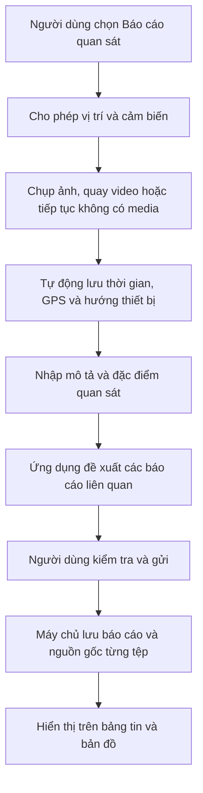

> **Điện thoại vừa là công cụ đăng báo cáo, vừa là thiết bị thu thập dữ liệu tại thời điểm quan sát.**

Báo cáo NASA thực sự có đề cập việc sử dụng ứng dụng mã nguồn mở trên smartphone để đồng thời thu thập hình ảnh và metadata từ cảm biến của nhiều người quan sát. NASA cũng chỉ ra dữ liệu UAP hiện thiếu metadata, thiếu chuẩn hóa và thiếu nhiều phép đo độc lập. [NASA UAP Independent Study Report](https://www.nasa.gov/wp-content/uploads/2023/09/uap-independent-study-team-final-report-0.pdf)

## 1. Định hướng sản phẩm phù hợp

Nên xây dựng theo mô hình:

- **Mobile app là ứng dụng chính:** ghi nhận hiện tượng tại hiện trường, chụp/quay, lấy vị trí, hướng thiết bị, thời gian và đăng báo cáo.
- **Web app là ứng dụng hỗ trợ:** khám phá bản đồ, đọc và phân tích báo cáo, tải lên tư liệu có sẵn, quản trị và kiểm duyệt.

Như vậy sản phẩm vẫn là nền tảng mạng xã hội đa nền tảng, nhưng mobile có thêm vai trò thu thập dữ liệu quan sát.

---

## 2. Phân biệt hai cách cung cấp tệp

### A. Ghi trực tiếp trong mobile app

Khi người dùng chụp ảnh hoặc quay video ngay trong ứng dụng, hệ thống có thể lưu đồng thời:

- Thời điểm thiết bị bắt đầu ghi;
- Thời điểm máy chủ nhận tệp;
- Tọa độ GPS;
- Độ chính xác của GPS;
- Hướng thiết bị;
- Góc nghiêng hoặc tư thế thiết bị;
- Loại thiết bị;
- Thông tin camera mà hệ điều hành cho phép truy cập;
- Tệp gốc;
- Mã băm của tệp sau khi máy chủ tiếp nhận.

Giao diện hiển thị nhãn:

> **Ghi trực tiếp bằng ứng dụng**

Nhãn này cho biết **nguồn gốc thu thập**, không khẳng định nội dung là thật.

### B. Người dùng tải tệp có sẵn lên

Áp dụng cho:

- Chọn ảnh/video từ thư viện điện thoại;
- Đăng tệp bằng trình duyệt máy tính;
- Tải lên tư liệu do người khác cung cấp;
- Bổ sung tài liệu cho một quan sát cũ.

Hệ thống vẫn nên:

- Giữ lại tệp gốc;
- Đọc EXIF hoặc metadata nếu có;
- Ghi nhận thời điểm tải lên;
- Cho người dùng khai báo thời điểm và nguồn của tệp;
- Đánh dấu nếu thời gian khai báo khác metadata;
- Không tự kết luận tệp đã bị làm giả.

Nhãn hiển thị:

> **Tệp do người dùng tải lên**

Hoặc chi tiết hơn:

- `Ghi trực tiếp bằng ứng dụng`;
- `Tải lên từ thư viện thiết bị`;
- `Tải lên từ trình duyệt web`;
- `Nguồn bên ngoài do người dùng khai báo`.

Đây là cách làm hợp lý hơn việc cấm hoàn toàn tệp tải lên. Nếu chỉ cho phép camera trong ứng dụng, hệ thống sẽ loại bỏ nhiều báo cáo hợp lệ được ghi trước khi người dùng biết đến nền tảng.

---

## 3. Nhãn này có ý nghĩa gì?

Nó giúp người xem biết **quá trình tệp đi vào hệ thống**:

| Nhãn                        | Điều hệ thống có thể nói                                            |
| --------------------------- | ------------------------------------------------------------------- |
| Ghi trực tiếp bằng ứng dụng | Ứng dụng đã nhận dữ liệu từ camera và cảm biến trong phiên ghi nhận |
| Tải lên từ thư viện         | Tệp đã tồn tại trước khi được chọn                                  |
| Tải lên từ web              | Máy chủ chỉ biết thời điểm nhận tệp và metadata còn lại             |
| Tư liệu từ nguồn khác       | Người đăng không xác nhận mình là người trực tiếp ghi hình          |

Không nên dùng các nhãn:

- “Bằng chứng xác thực”;
- “Ảnh thật”;
- “Không chỉnh sửa”;
- “Đã được xác minh”.

Ngay cả video ghi trực tiếp vẫn có thể quay màn hình khác, quay một vật thể được dàn dựng hoặc nhận dữ liệu vị trí sai. Nó có **nhiều ngữ cảnh thu thập hơn**, chưa đủ để chứng minh hiện tượng.

---

## 4. Ba loại nội dung âm thanh cũng cần phân biệt

“Ghi âm” có thể mang ba ý nghĩa khác nhau:

1. **Âm thanh tại hiện trường:** được ghi cùng thời điểm quan sát;
2. **Lời kể của nhân chứng:** người dùng thuật lại trải nghiệm sau đó;
3. **Tệp âm thanh bổ sung:** được tải từ thiết bị hoặc nguồn bên ngoài.

Trong dữ liệu nên lưu riêng:

```text
OBSERVATION_AUDIO
WITNESS_NARRATION
UPLOADED_AUDIO
```

Lời kể bằng giọng nói giúp báo cáo dễ thực hiện hơn, nhưng không nên được xem ngang với âm thanh ghi tại hiện trường.

---

## 5. Phần nào trong đề xuất của partner rất hợp lý?

Các ý nên giữ:

- Báo cáo quan sát có cấu trúc;
- Thu thập thời gian, GPS và hướng thiết bị;
- Tận dụng camera và cảm biến smartphone;
- Ghi nhận điều kiện thời tiết;
- Tìm các báo cáo gần nhau về vị trí và thời gian;
- So sánh với các đối tượng thông thường như máy bay hoặc vệ tinh;
- Cho cộng đồng thảo luận và đưa ra giả thuyết;
- Hỗ trợ xuất dữ liệu có cấu trúc;
- Tối ưu biểu mẫu để người dùng không phải nhập quá nhiều.

Đặc biệt, mobile app giúp tự động thu thập một phần dữ liệu thay vì yêu cầu người dùng nhớ và nhập thủ công.

---

## 6. Những ý trong file đang nói quá mạnh

### “Phát hiện ảnh/video đã chỉnh sửa”

Đây là bài toán rất khó. Kiểm tra EXIF hoặc artifact chỉ cung cấp dấu hiệu, không đủ kết luận tệp thật hay giả.

Trong phạm vi đồ án, nên đổi thành:

> **Phân tích tính toàn vẹn và nguồn gốc kỹ thuật của tệp.**

Hệ thống có thể phát hiện:

- Tệp không có metadata;
- Metadata có điểm bất thường;
- Thời gian khai báo không khớp metadata;
- Tệp trùng với tệp đã đăng;
- Tệp đã thay đổi sau khi máy chủ tiếp nhận.

### “Dùng AI để xác minh UAP”

Không nên dùng từ “xác minh”. Không có tập dữ liệu đủ tốt để mô hình kết luận một vật thể là UAP thật.

Có thể dùng AI cho các tác vụ hẹp:

- Gợi ý phân loại quan sát;
- Phát hiện ảnh mờ hoặc quá tối;
- Trích xuất metadata;
- Tìm báo cáo tương tự;
- Nhận diện một số vật thể phổ biến;
- Hỗ trợ kiểm duyệt spam.

### “Điểm uy tín xác định độ tin cậy”

Điểm uy tín có thể dùng để:

- Hạn chế spam;
- Ưu tiên nội dung cần xem xét;
- Mở quyền kiểm duyệt cộng đồng.

Nó không chứng minh báo cáo của người có điểm cao là đúng. Phần giao diện nên trình bày dữ kiện riêng:

- Cách tệp được cung cấp;
- Metadata nào có sẵn;
- Có bao nhiêu báo cáo tương tự;
- Có bao nhiêu tệp đính kèm;
- Những giả thuyết nào đã được đề xuất.

---

## 7. Luồng đăng báo cáo phù hợp cho mobile



Người dùng không bắt buộc phải có ảnh hoặc video. Nhiều hiện tượng xảy ra quá nhanh để mở camera kịp; bắt buộc media sẽ làm mất báo cáo nhân chứng.

---

## 8. Cách mô tả đề tài sau khi bổ sung mobile app

> **Xây dựng nền tảng mạng xã hội đa nền tảng phục vụ thu thập và thảo luận các báo cáo quan sát hiện tượng bất thường trên bầu trời, trong đó ứng dụng di động hỗ trợ ghi nhận dữ liệu có cấu trúc từ camera, vị trí và cảm biến của thiết bị.**

Cách mô tả này làm đề tài mạnh hơn đáng kể vì mobile app có vai trò nghiệp vụ cụ thể. Hội đồng có thể nhìn thấy:

- Lý do cần mobile;
- Sự khác biệt với mạng xã hội thông thường;
- Mối liên hệ với khuyến nghị trong báo cáo NASA;
- Bài toán kỹ thuật về camera, sensor, metadata, bản đồ, dữ liệu không gian và quyền riêng tư.

**Định hướng hợp lý nhất là mobile first kèm web app.** Camera trong app tạo ra mức thông tin nguồn gốc cao hơn; tệp tải lên vẫn được chấp nhận và được ghi nhãn trung lập theo cách nó đi vào hệ thống.
